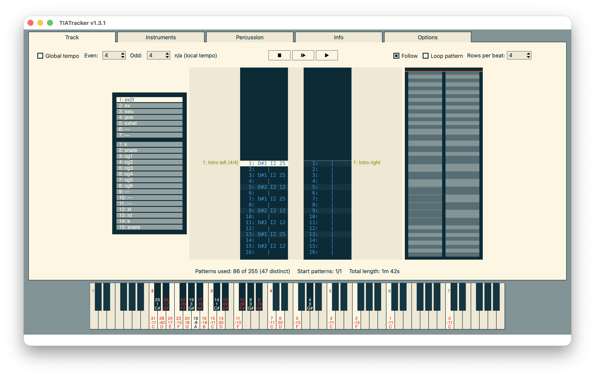

# TIATracker #

A music tracker for creating Atari VCS 2600 music on Windows, macOS and Linux, including a sound routine for playback on the VCS.

Current version: 1.3.1

© 2016-2017 by Andre "Kylearan" Wichmann (andre.wichmann@gmx.de)

* Manual: [TIATracker_manual.pdf](https://raw.githubusercontent.com/dionoid/tiatracker/refs/heads/master/data/TIATracker_manual.pdf
)
* Windows, Linux and macOS binaries: [Releases](https://github.com/dionoid/tiatracker/releases)
* Seminar talk from Revision 2016 about VCS music in general and TIATracker in particular: [Video recording](https://www.youtube.com/watch?v=PVujzQySZls)



## Features ##

VCS sound routine features:

* Up to 7 melodic and 15 percussion instruments
* ADSR envelopes for volume and frequency for melodic instruments
* "Overlay" percussion which will play the next melodic notes immediately
* Arbitrary and variable pattern lengths individual for each channel
* An option for different tempo values for odd and even rows ("Funkspeed")
* An option to have different tempo values per pattern instead of global tempo
* Highly optimized and configurable replayer routine
* Richly documented source code, including specifications for all data structures

Tracker features:

* Graphical representation for available notes per waveform and how off-tune they are
* Customizable pitch guides optimizing the number of in-tune notes
* Graphical editors for melodic and percussion instruments
* Integrated pattern editor and sequencer
* Timeline "mini map" displaying the pattern sequences
* Sound emulation from the Stella emulator for playback
* Export to dasm, k65 and .csv

For feedback, bug reports and feature requests, send a mail to andre.wichmann@gmx.de!

## Compiling from source

Requires **Qt 6** (Core, GUI, Widgets and qmake), **SDL2**, **pkg-config**, Make
and a **C++17 compiler**. Qt Creator is optional.

Tested on macOS, Windows (using MSYS2) and Debian Linux.

### Build commands

Install the dependencies for your platform below, then run these commands from
the repository directory:

```sh
make check          # Verify the toolchain and dependencies
make                # Build the application
make run            # Build and launch
make release        # Create a distributable package (see platform notes)
make clean          # Remove compiled files, keeping personal resources
```

### Linux: Debian / Linux Mint

Install the dependencies:

```sh
sudo apt update
sudo apt install build-essential pkg-config qt6-base-dev qt6-base-dev-tools qmake6 libsdl2-dev dpkg-dev binutils
```

On other distributions, install the equivalent development packages listed above.
The build goes into `build/linux/`, with default resources in `build/linux/data/`.
Qt and SDL2 must remain installed; the app can run from any working directory.

#### Debian / Mint package

```sh
make release
sudo apt install ./build/debian/tiatracker_1.3.1-1_amd64.deb
```

- Use the filename printed by `make release` if the version or architecture differs.
  Override the version with `make release DEB_VERSION=1.3.1-2`.
- Package creation needs no sudo and does not install the app. After installation,
  launch **TIATracker** from the application menu or run `tiatracker`.
- APT installs Qt and SDL2 as runtime dependencies; they are not bundled.
  Build separately for each target distribution/release. Custom Qt/SDL installs
  without Debian package metadata are unsupported by this packaging target.
- Removing the package leaves personal resources intact.

### Windows: MSYS2 UCRT64

Install the x86_64 version of [MSYS2](https://www.msys2.org/), then open
**MSYS2 UCRT64** from the Start menu and install the dependencies:

```sh
pacman -S --needed make mingw-w64-ucrt-x86_64-gcc \
  mingw-w64-ucrt-x86_64-make mingw-w64-ucrt-x86_64-pkgconf \
  mingw-w64-ucrt-x86_64-qt6-base mingw-w64-ucrt-x86_64-SDL2
```

Use UCRT64 packages throughout so the compiler and libraries match. Run the
shared build commands in this terminal, using **`make`, not `mingw32-make`**;
the Makefile invokes `mingw32-make` internally. No separate install step is needed.

The development executable is `build/ucrt64/TIATracker.exe`. Launch it with
`make run` in UCRT64 so the Qt and SDL2 DLLs are on `PATH`. Default resources
are embedded in the executable.

#### Standalone executable

`make release` creates **`build/windows/TIATracker.exe`**. Only this file needs to
be copied: it includes resources, Qt plugins, SDL2 and runtime dependencies.
Double-click it to run without MSYS2, separately installed Qt/SDL or PATH changes.
The launcher extracts the runtime to a temporary folder and removes it on normal
exit. Run `make release` again after rebuilding or updating dependencies.

### macOS: Homebrew

Requires **macOS 15 or newer** for the tested build. Dependencies may require a
newer version; lowering the compiler deployment target alone is not sufficient.

Install Apple's Command Line Tools if needed, then install the dependencies
with [Homebrew](https://brew.sh/):

```sh
xcode-select --install
brew install qtbase sdl2 pkgconf
```

- `qtbase` includes the build and deployment tools; neither full Xcode nor
  a separate `qttools` package is required. No global Qt PATH changes are needed.
- Homebrew's `sdl2` resolves to `sdl2-compat` (backed by SDL3). Native SDL2 also
  works if `pkg-config --exists sdl2` succeeds.
- Match the compiler and library architectures: do not mix ARM64 libraries
  with a Rosetta toolchain.

The development bundle is `build/macos/TIATracker.app`, with default resources
inside it. **Launch with `make run`**; this build depends on installed Qt/SDL.

#### Standalone app

`make release` creates **`build/macos-deploy/TIATracker.app`** without a ZIP archive.
Open the app in Finder, or move it to **Applications**. No companion folders or installed
Homebrew/Qt/SDL are needed: all resources and non-system dependencies are bundled,
including SDL3 when using `sdl2-compat`.

Packaging verifies library dependencies and code signatures before replacing
previous output, leaving the development bundle unchanged. The app targets the
build machine's architecture, not a universal Intel/Apple Silicon binary, and
the destination macOS version must support the bundled libraries.

**The app is ad-hoc signed, not notarized.** Gatekeeper may block downloaded
copies on another Mac. Public distribution needs a separate Developer ID signing
and notarization workflow; `make release` does not perform these steps.

### Personal resources (all platforms)

On startup, TIATracker copies missing defaults into **Documents/TIATracker** and
uses those personal copies: the keymap, songs, instruments, guides, player
templates, manual and license. It uses the system's configured Documents folder,
including localized or redirected locations such as OneDrive.

- **Existing files are never overwritten**, including after rebuilds or upgrades.
  Missing defaults are restored on launch; move an old copy elsewhere to adopt
  an updated default. Build and packaging commands leave personal files alone.
- Song, instrument, percussion and guide dialogs start in their corresponding
  subfolders on each launch. Exports default to `Documents/TIATracker/exports`;
  the last export folder is remembered separately from song open/save locations.
- On macOS, allow Documents access if prompted. Resource setup errors stop
  startup and identify the affected path; personal edits do not alter the signed app.

### Qt Creator (optional)

Open `TIATracker.pro`, select a Qt 6 kit with a C++17 compiler, and add a
`make install` build step. Ensure `pkg-config` can find SDL2 for the kit's
architecture (use the UCRT64 package for the Windows setup above).
